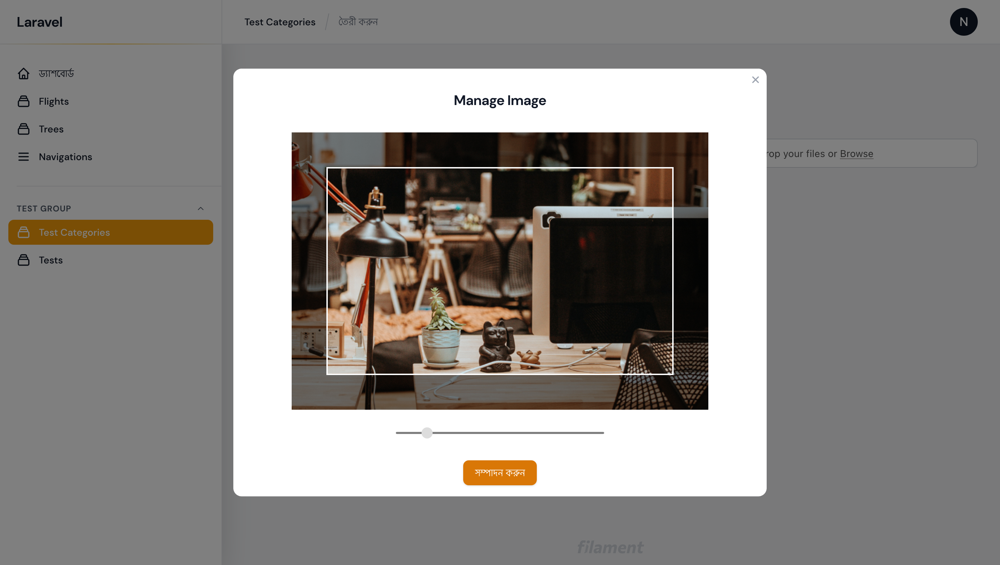
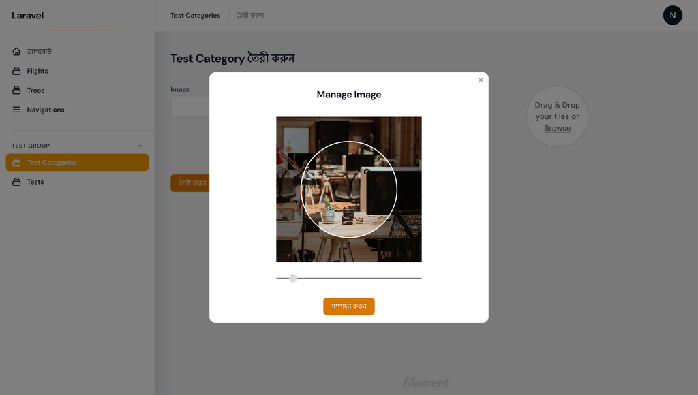
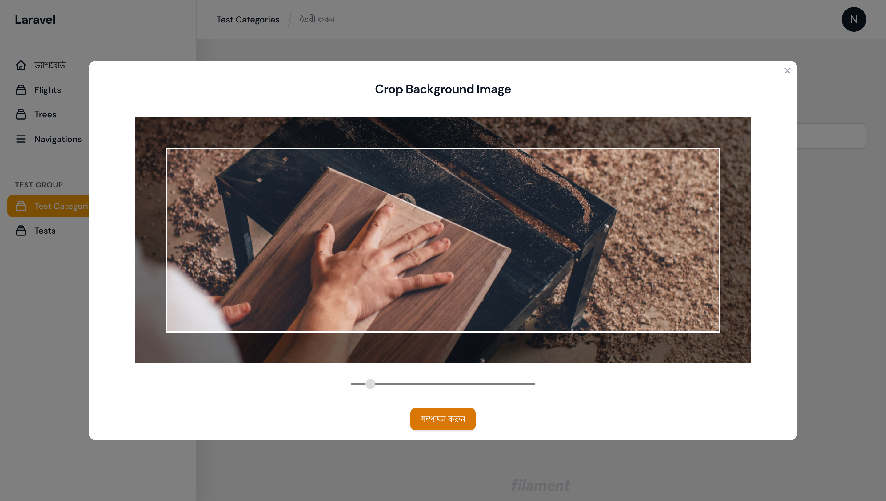

# Filament Croppie Plugin

[](https://packagist.org/packages/nuhel/filament-croppie)
[](https://packagist.org/packages/nuhel/filament-croppie)


## Installation

You can install the package via composer:

```bash
composer require nuhel/filament-croppie
```

This field has most of the same functionality of the [Filament File Upload](https://filamentphp.com/docs/2.x/forms/fields#file-upload) field.


```php
  Croppie::make('image')
      ->getUploadedFileNameForStorageUsing(function (TemporaryUploadedFile $file): string {
          return (string)str("image_path/" . $file->hashName());
      })->enableDownload()
      ->enableOpen()
      ->imageResizeTargetWidth('1000')
      ->imageResizeTargetHeight('800'),
```
Using `imageResizeTargetWidth` and `imageResizeTargetHeight` we can set width and height of the cropper.

```php
Croppie::make('avatar')->avatar()
    ->enableOpen()->enableDownload()
    ->imageResizeTargetWidth('300')
    ->imageResizeTargetHeight('300')
    ->modalSize('xl'),
```

By default, the size of the resulting image will correspond to `imageResizeTargetWidth` and `imageResizeTargetHeight`. Using `keepOriginalSize`, the size of the resulting image will be at the original scale of the image.

```php
Croppie::make('avatar')->avatar()
    ->enableOpen()->enableDownload()
    ->imageResizeTargetWidth('300')
    ->imageResizeTargetHeight('300')
    ->keepOriginalSize()
    ->modalSize('xl'),
```
By default, there is no outer container of the cropper. Using `withBoundary`, we can specify the outer container of the cropper. The specified value is in pixel and will be added to the width and the height of the cropper.

```php
Croppie::make('avatar')->avatar()
    ->enableOpen()->enableDownload()
    ->imageResizeTargetWidth('300')
    ->imageResizeTargetHeight('300')
    ->withBoundary('30')
    ->modalSize('xl'),
```


We can make croppie circular using `avater` method.


Modal size can be customized if it is needed,
using `modalSize` method.
```php
Croppie::make('background')
    ->enableDownload()
    ->enableOpen()
    ->imageResizeTargetWidth('1000')
    ->imageResizeTargetHeight('400')
    ->modalSize('6xl')
    ->modalHeading("Crop Background Image")
```


This Plugin is still under development. Some Croppie Feature need's to be implemented, but it provides the main feature of Croppie.  
## License

The MIT License (MIT). Please see [License File](LICENSE.md) for more information.
